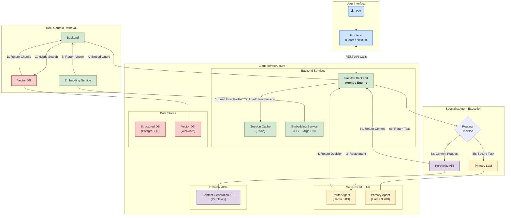

# Agentic Architecture Overview Template

## 1. Introduction to Agents

- Agents are autonomous software entities capable of perceiving their environment, making decisions, and taking actions to achieve specific goals. 
- Agents can range from simple rule-based bots to complex AI-driven components that learn and adapt over time.

---

## 2. Designing Agents

Key considerations:

- Autonomy: Degree of independent decision-making.
- Communication: Protocols for agent-to-agent and agent-to-system interaction.
- Learning: Ability to adapt based on feedback or data.
- Goal Orientation: Clear objectives guiding agent behavior.

Here is a simple example of an agent: https://github.com/techwithtim/LangGraph-Tutorial

---

## 3. Agentic Architecture for a Learning Platform

In the context of a learning platform, agentic architecture enables personalized, adaptive, and scalable experiences. Example agents include:

- Content Recommendation Agent: Suggests learning materials based on user progress. 
- Assessment Agent: Generates and grades quizzes tailored to individual learners. 
- Engagement Agent: Monitors activity and nudges users to stay on track (Calendar integration).

These agents interact with platform data, user profiles, and external resources to deliver a dynamic learning journey.

---

## 4. Concept Flow

1.  **Login & Profile Load:** User logs in. The system loads their structured profile (`role`, `level`, `completed_modules`).
2.  **Initial Prompt Generation:** The **Learning Navigator Agent** generates three relevant starting prompts based on the user's profile.
3.  **User Selection:** The user clicks on a prompt (e.g., "Show me a simple example of AI summarizing a market report.").
4.  **Content Retrieval:** The main **Trainer Agent** takes this request. It queries the Curriculum Vector DB, filtering by metadata (`topic: 'use_cases'`, `difficulty: 'beginner'`, `role: 'finance'`) and then using vector search to find the most relevant content chunk.
5.  **Synthesize & Deliver:** The agent sends the retrieved content (including text, examples, and the YouTube link from the Curation Agent) to the LLM to be presented to the user in a clear, conversational format.
6.  **Follow-up Prompt Generation:** After delivering the content, the **Learning Navigator Agent** generates the next three strategic prompts ("Go Deeper," "Go Broader," "Apply It").
7.  **Assessment Opportunity:** If the user has completed a logical section, the **Assessment Agent** is triggered by the Navigator to offer a quiz. Passing the quiz updates the user's profile.
8.  **Loop:** The user continues their journey by selecting the next prompt, creating a seamless and adaptive learning experience.

---

## 5. Requirements for Agentic Architecture

| Component | Recommended Technology | Pros | Cons |
| :--- | :--- | :--- | :--- |
| **Backend Framework** | Python with **FastAPI** | **High Performance:** Asynchronous support makes it very fast, ideal for I/O-bound tasks like calling multiple LLM APIs.   **Modern:** Built-in data validation with Pydantic reduces bugs.   **Easy to Use:** Automatic interactive API documentation (Swagger UI) simplifies development and testing. | **Newer Ecosystem:** While growing rapidly, it has a smaller ecosystem than giants like Django.   **Requires Async Mindset:** Fully leveraging its power requires understanding `async/await` principles. |
| **Agent Orchestration** | **LangChain** | **Industry Standard:** The most popular framework with extensive documentation, tutorials, and community support.   **Vast Integrations:** Connects to virtually every LLM, database, and tool you can think of.   **High-Level Abstractions:** Simplifies complex patterns like ReAct agents, RAG, and multi-agent collaboration. | **Steep Learning Curve:** The sheer number of abstractions can be overwhelming.   **Rapidly Evolving:** The API can have breaking changes between versions, requiring maintenance to keep up. |
| **Primary LLM (Secure & Controllable)** | Self-hosted **Llama 3 70B Instruct** | **Data Privacy & Full Control:** All data and model weights remain within our infrastructure. No external API calls for sensitive tasks.   **State-of-the-Art Performance:** A top-tier open-source model with reasoning capabilities rivaling proprietary models.   **No Per-Call Cost:** After the initial hardware/hosting setup, inference is free. | **Significant Infrastructure Cost:** Requires powerful, expensive GPUs (e.g., NVIDIA H100s or A100s) for good performance.   **High Operational Overhead:** Our team is responsible for deployment, scaling, maintenance, and security. |
| **Content Gen & Search LLM** | **Perplexity API (`pplx-api`)** | **Excellent Internet Access:** Natively designed for search; provides up-to-date information and cited sources, fulfilling our core requirement.   **High-Quality Generation:** Strong at synthesizing information from multiple sources into coherent explanations. | **External Dependency:** Relies on a third-party service; subject to their downtime and pricing changes.   **Cost:** Pay-per-use model can become expensive with high volume. |
| **Structured Database (Profiles & Metadata)** | **PostgreSQL** (Managed Service like Amazon RDS) | **Reliable & Mature:** Battle-tested, enterprise-grade, and perfect for structured data like user profiles and content metadata.   **Powerful Querying:** Robust SQL capabilities for complex queries on our user data.   **Managed Offerings:** Services like RDS handle backups, patching, and scaling, reducing our operational load. | **Not for Vectors:** While `pgvector` exists, using a separate, dedicated vector DB is our preference for optimized performance. |
| **Vector Database** | **Weaviate** | **Purpose-Built for AI:** Optimized for speed and scalability in vector search.   **Hybrid Search:** Natively supports filtering by metadata alongside vector search, which is crucial for our curriculum engine.   **Flexible Deployment:** Can be used as a managed cloud service (easier) or self-hosted (more control). | **Added Complexity:** Introduces another database system into our stack that needs to be managed and maintained. |
| **Frontend Framework** | **React** with **Next.js** | **Rich Ecosystem:** Unmatched number of libraries, components, and tools available.   **Strong Performance:** Next.js provides excellent performance optimizations like server-side rendering (SSR). | **Complexity:** Can be complex to configure and has a steeper learning curve than simpler frameworks like Vue or Svelte. |

### \#\# Multi-LLM Architecture & Context Passing

  * **Orchestrator/Router Agent (Fast & Cheap):** A smaller, faster version like **Llama 3 8B Instruct** is perfect here. Its job is to quickly route user intent.
  * **Content Generation Agent (Creative & Web-Connected):** **Perplexity API** remains the best choice due to its native web search.
  * **Quiz & Navigator Agents (Instruction Following):** Our self-hosted **Llama 3 70B Instruct** is ideal. It's powerful enough to generate creative follow-up prompts and reason through quiz creation without the cost of an external API call.
  * **Domain-Specific Agent (Secure & Knowledgeable):** **Llama 3 70B Instruct** is our go-to here. You can even fine-tune it on internal documents to make it an expert on Federated Hermes' specific needs.

## 6. Diagram

