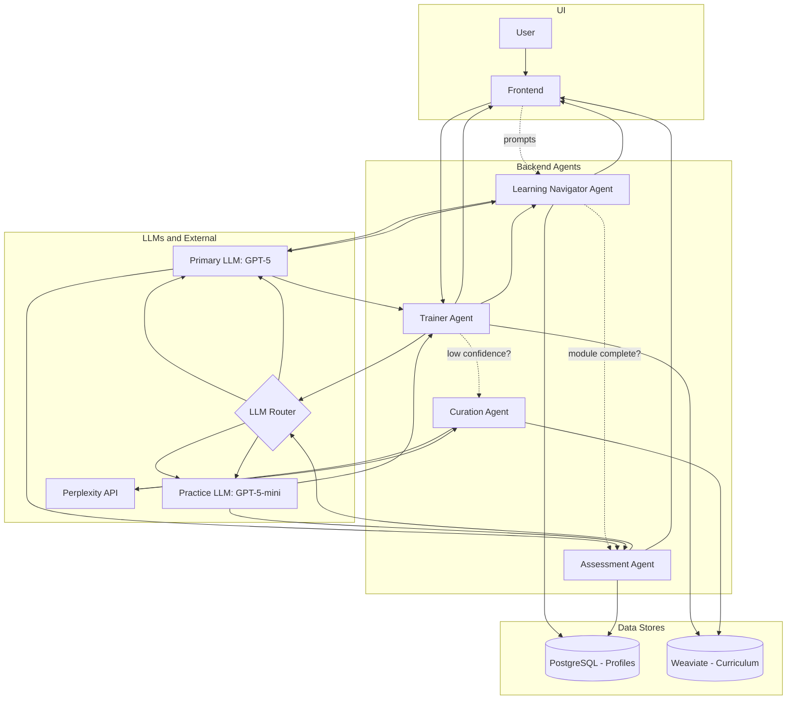

# Learning Platform Architecture

## Concept Flow

1. **User Profile Creation:** On first login, users complete a brief survey to assess their AI knowledge and learning goals. This data is stored in a structured profile (`role`, `level`, `completed_modules`). Role stands for job function (e.g., finance, marketing), level indicates proficiency (beginner, intermediate, advanced), and completed_modules tracks progress.
2. **Login & Profile Load:** User logs in. The system loads their structured profile (`role`, `level`, `completed_modules`).
3. **Initial Prompt Generation:** The **Learning Navigator Agent** generates three relevant starting prompts based on the user's profile and previous interactions. For example, a beginner in finance might see:
   - "Show me a simple example of AI summarizing a market report."
   - "How can I use AI to generate client emails?"
   - "What are basic prompt structures for financial analysis?"
   - "Refresh Prompts"
   - "Surprise me with a new topic"
   These prompts are designed to be engaging and directly relevant to the user's role and proficiency level.
4. **User Selection:** The user clicks on a prompt (e.g., "Show me a simple example of AI summarizing a market report.").
5. **Content Retrieval:** The main **Trainer Agent** takes this request. It queries the Curriculum Vector DB, filtering by metadata (`topic: 'use_cases'`, `difficulty: 'beginner'`, `role: 'finance'`) and then using vector search to find the most relevant content chunk.
6. **Knowledge Base Building:** In case the content chunk shows low confidence or lacks real-world examples, the **Curation Agent** is triggered. It performs a web search (using Perplexity API) to find up-to-date articles, case studies, or YouTube videos relevant to the prompt. The agent extracts key points and a link to a high-quality videos, blogs and podcasts that illustrates the concept. This external content is then broken down into digestible pieces and stored back in the Curriculum Vector DB with appropriate metadata for future use.
7. **Retry Retrieval:** The **Trainer Agent** re-queries the Curriculum Vector DB, now enriched with the newly curated content, to retrieve a comprehensive answer that includes both foundational knowledge and real-world examples.
8. **Synthesize & Deliver:** The agent sends the retrieved content (including text, examples, and the YouTube link from the Curation Agent) to the LLM to be presented to the user in a clear, conversational format.
9. **Follow-up Prompt Generation:** After delivering the content, the **Learning Navigator Agent** generates the next three strategic prompts.
10. **Assessment Opportunity:** If the user has completed a logical section, the **Assessment Agent** is triggered by the Navigator to offer a quiz. Passing the quiz updates the user's profile.
11. **Loop:** The user continues their journey by selecting the next prompt, creating a seamless and adaptive learning experience.
12. **Progress Tracking:** The system continuously updates the user's profile with completed modules, quiz scores, and interaction history to refine future prompt suggestions.
13. **Continuous Learning:** As the user progresses, the system adapts by offering more advanced prompts and content, ensuring a personalized learning path.
14. **Feedback Loop:** Users can provide feedback on content quality, which is reviewed by the Curation Agent to improve future content selection and curation.
15. **Scheduling Learning Sessions:** Users can schedule regular learning sessions by integrating with calendar APIs. The system sends reminders and prepares tailored content for each session based on the user's progress and upcoming learning goals.

## Architecture Diagram

## Technology Stack

| Component | Recommended Technology | Pros | Cons |
| :--- | :--- | :--- | :--- |
| **Backend Framework** | Python with **FastAPI** | **High Performance:** Asynchronous support is ideal for I/O-bound tasks like calling multiple LLM APIs. **Modern & Robust:** Built-in data validation with Pydantic reduces bugs. **Easy to Use:** Automatic interactive API documentation simplifies development. | **Newer Ecosystem:** Has a smaller ecosystem than giants like Django. **Requires Async Mindset:** Fully leveraging its power requires understanding `async/await`. |
| **Agent Orchestration** | **LangChain** | **Industry Standard:** The most popular framework with extensive documentation and community support. **Vast Integrations:** Connects to virtually every LLM, database, and tool. **High-Level Abstractions:** Simplifies complex patterns like RAG and multi-modal agents. | **Steep Learning Curve:** The sheer number of abstractions can be overwhelming. **Rapidly Evolving:** APIs can have breaking changes, requiring maintenance to keep up. |
| **Primary Tutor LLM** *(AI Concepts & Reasoning)* | OpenAI **`GPT-5`**  | **State-of-the-Art Accuracy:** Best-in-class for delivering reliable, adaptive, and conversational tutoring. **Stable & Predictable:** Forms the consistent "closed-book" foundation for the core curriculum. | **Highest Operational Cost:** These are premium models; their use should be reserved for high-value reasoning and teaching tasks. |
| **Practice & Mid-Tier LLM** *(Prompt Engineering Labs)* | OpenAI **`GPT-5-mini`** | **Excellent Price/Performance:** Balances high-quality output with a significantly lower cost, ideal for interactive practice sessions. **Versatile:** Capable enough for lightweight quizzes, definitions, and structured exercises. | **Less Nuanced:** Not as capable as the top-tier models for deeply adaptive or multi-turn teaching conversations. |
| **Web Research Engine** *(Research Mode)* | **Perplexity API**  | **Fresh, Cited Information:** Provides up-to-date, real-world examples with sources, triggered only when needed. **Enhances Trust:** Grounding responses in verifiable external data adds credibility. | **Added Complexity:** Requires managing the logic to switch between "closed-book" and "research" modes. **External Dependency:** Relies on the search provider's uptime and API. |
| **Structured Database** *(Profiles & Metadata)* | **PostgreSQL** (Managed Service) | **Reliable & Mature:** Battle-tested and perfect for structured data like user profiles. **Powerful Querying & Flexibility:** Robust SQL capabilities, with `JSONB` support for future schema changes. **Managed Offerings:** Services like AWS RDS handle backups, patching, and scaling. | **Not Natively for Vectors:** Requires a dedicated vector DB for optimal performance, which is already part of this stack. |
| **Vector Database** | **Weaviate** | **Purpose-Built for AI:** Optimized for speed and scalability in vector search. **Hybrid Search:** Natively supports filtering by metadata alongside vector search, which is crucial for multi-user RAG. **Flexible Deployment:** Can be used as a managed service or self-hosted. | **Added Complexity:** Introduces another database system into the stack that needs to be managed and maintained. |
| **Frontend Framework** | **React** with **Next.js** | **Rich Ecosystem:** Unmatched number of libraries, components, and tools available. **Strong Performance:** Next.js provides excellent optimizations like server-side rendering (SSR). | **Complexity:** Can be complex to configure and has a steeper learning curve than simpler frameworks. |

## Future Considerations
- **Redundancy & Failover:** Implement multi-region deployments for critical components (e.g., PostgreSQL, Weaviate) to ensure high availability.
- **Monitoring & Analytics:** Integrate tools like Prometheus and Grafana for real-time monitoring of system health and usage patterns.
- **Deployment & CI/CD:** Use platforms like GitHub Actions or Jenkins for automated testing and deployment pipelines.
- **Containerization:** Consider Docker and Kubernetes for scalable, containerized deployments, especially if the user base grows significantly.
- **Testing:** Implement unit tests, integration tests, and end-to-end tests to ensure system reliability and performance.
- **Data Retention & Privacy:** Establish clear policies for data retention, especially for user profiles and interaction logs, to comply with privacy regulations.