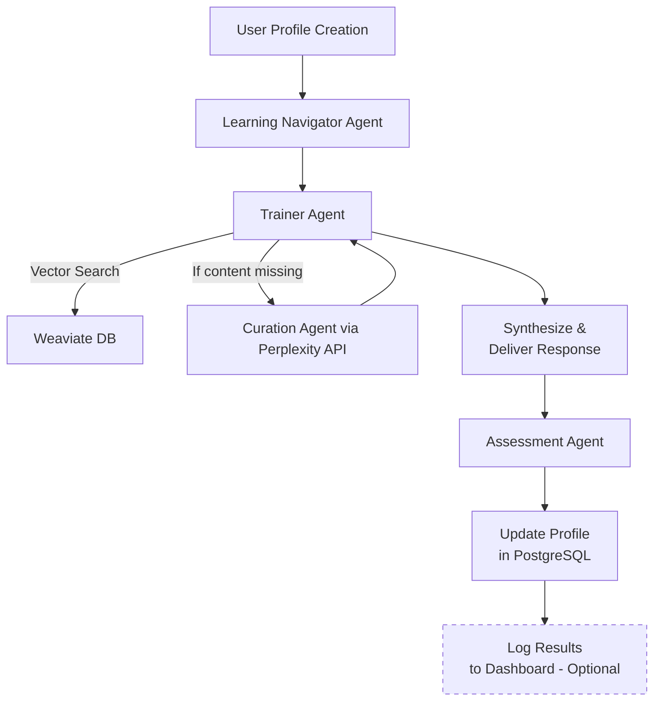

# Agent Orchestration Architecture

## Overview
Our learning platform uses an **agent-based architecture** to deliver adaptive, personalized AI training.  
- **LangChain/LangGraph**: Runs the **core logic of each agent** (reasoning, tool use, pedagogy).  
- **n8n**: Serves as the **lightweight orchestration and visualization layer**, connecting agents to external systems (DBs, APIs, notifications) and providing monitoring & error handling.  
  - **Pricing:** n8n offers a 14-day free trial, then $24/month.  

This hybrid setup balances **flexibility (LangChain)** with **ease of integration (n8n)**.

---

## Alternative: Using Only LangChain/LangGraph for Orchestration

If we decide not to include n8n, LangChain/LangGraph can serve as the **sole orchestration framework**.

### Pros
- **Full Control in Code:**  
  All orchestration logic (agent coordination, retries, error handling) lives in Python. Developers have complete flexibility.  
- **Tighter Integration with Agent Logic:**  
  Orchestration and reasoning run in the same framework, reducing handoff complexity.  
- **Customizability:**  
  Complex multi-agent workflows (e.g., Tutor Agent → Assessment → Planner) can be coded with precise logic.

### Cons
- **Developer Overhead:**  
  Every integration (Postgres, Teams, Power BI, Outlook, Slack, etc.) must be written and maintained in Python.  
- **Slower Iteration:**  
  Changes to workflows require code updates, reviews, and redeployment instead of visual drag-and-drop.  
- **Monitoring & Observability Gaps:**  
  LangChain provides callbacks, but no built-in dashboards or retry queues like n8n’s workflow UI.  
- **Steeper Learning Curve for Non-Developers:**  
  Stakeholders cannot easily view or adjust workflows without developer support.

### When It May Limit Us
- If the client expects **many external integrations** (Teams, Outlook, Power BI, Databricks, etc.), writing and maintaining all connectors in Python could be time-consuming.  
- If we want **business visibility into workflows**, n8n provides a friendlier monitoring and debugging surface.  

---

## Key Agents
1. **Learning Navigator Agent**  
   - Generates relevant prompts based on user profile, role, and past learning history.  
   - Hands prompts to the **Trainer Agent**.  

2. **Trainer Agent**  
   - Retrieves content from the Curriculum Vector DB (Weaviate).  
   - Synthesizes explanations with GPT-5.  
   - If content is missing, triggers the **Curation Agent**.  

3. **Curation Agent**  
   - Performs web search (Perplexity API, Google Search) to supplement missing materials.  
   - Returns fresh references to the Trainer Agent.  

4. **Assessment Agent**  
   - Generates quizzes to evaluate user understanding.  
   - Updates the user profile in Postgres based on assessment outcomes.  

---

## Orchestration Flow

---

## How the Orchestration Works

1. **User Profile Creation**

    - Every new learner starts by filling out a short survey.
    - This helps us understand their role, AI knowledge level, and what they want to learn.

2. **Learning Navigator Agent**

    - Based on that profile, the Navigator suggests a few starting prompts or topics.
    - Think of it as a personalized “learning guide” that tailors the journey for each employee.

3. **Trainer Agent**

    - When a user selects a topic, the Trainer Agent takes over.
    - It first searches our internal Weaviate database for relevant learning content.
    - If the database doesn’t have enough material, it calls the Curation Agent, which can fetch and summarize trusted external references (for example via Perplexity).

4. **Synthesize & Deliver Response**

    - The Trainer Agent then pulls everything together into a clear explanation or lesson.
    - This is what the employee sees in the learning interface.

5. **Assessment Agent**

    - After content delivery, the Assessment Agent provides a short quiz or activity.
    - This helps measure whether the employee understood the material.

6. **Update Profile in PostgreSQL**

    - Results are saved back to the user’s profile.
    - Over time, the system builds a record of strengths and areas where more learning is needed.

7. **(Optional) Log Results to Dashboard**

    - We can also log results into dashboards for clients to track progress.
    - This step is optional, but it helps track adoption and impact at the organizational level.
