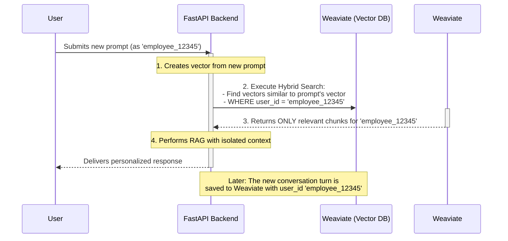

# Technical Discovery: Exploration on Memory to Isolate User Profiles

## Objective: 

Investigate memory management techniques to isolate user profiles in a multi-user AI tutoring system.

-----

## Motivation:
- Ensure personalized learning experiences for each user.
- Prevent cross-contamination of user data and preferences.
- Maintain privacy and security of user interactions.
- Enable scalable multi-user support without degradation of service.
- Facilitate adaptive learning by retaining user-specific context.
- Improve user satisfaction through tailored responses.
-----

## Background & Context:
The learning system is designed to cater to multiple users concurrently.
Each user interacts with the AI tutor, which must remember their progress, preferences, and past interactions. 
Effective memory management is crucial to ensure that each user's data remains isolated and secure.
-----

## Approach:

### 1. Storing Conversation History (Ingestion)

Whenever a user interacts with the platform, we don't just store the conversation text and its vector. We also attach metadata to it.

1.  **Get User ID:** When a user logs in, the **FastAPI backend** will have access to their unique ID, fetched from the **PostgreSQL** database.
2.  **Chunk & Embed:** Take each turn of the conversation (e.g., the user's prompt and the AI's response) and convert it into a vector using the embedding model.
3.  **Store with Metadata:** When we save this vector into **Weaviate**, we include a metadata object with it. This object will contain, at a minimum, the `user_id`.

A data entry in Weaviate would look something like this:

```json
{
  "content": "Okay, show me how to apply that to our Q3 financial report.",
  "vector": [0.012, -0.345, ..., 0.987],
  "metadata": {
    "user_id": "employee_12345",
    "session_id": "session_xyz789",
    "timestamp": "2025-09-18T21:36:10Z"
  }
}
```

### 2. Retrieving Personalized History (RAG Query)

Now, when that same user asks a new question, the RAG process is modified to be user-specific.

1.  **Identify User:** Our backend identifies the current user as `employee_12345`.
2.  **Create Query Vector:** The user's new prompt ("What was the key takeaway from our last discussion?") is converted into a vector.
3.  **Perform a Hybrid Search:** Our **Trainer Agent** instructs Weaviate to perform a search that combines two conditions:
      * **Vector Search:** Find the conversation chunks that are most semantically similar to the new prompt's vector.
      * **Metadata Filter:** From those results, **only return chunks where the `user_id` metadata field exactly matches `employee_12345`**.

This filtering step is the key. It creates a secure wall, ensuring that the RAG process for `employee_12345` can *only* access their own past conversations, even though all conversations are in the same database. Another user, `employee_67890`, would have their queries filtered by their own ID, retrieving only their context.

-----

## Implementation Diagram

This sequence diagram shows how the FastAPI backend would manage the request to ensure data isolation.



**Weaviate** is excellent for this, as it natively supports hybrid search (combining vector search with metadata filtering). This method is efficient, scalable, and ensures robust data privacy between users.
